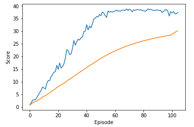

# Deep Deterministic Policy Gradient (DDPG)
The model I did chose to solve the task is outlined in [this paper](https://arxiv.org/pdf/1509.02971.pdf), _Continuous Control with Deep Reinforcement Learning_, by researchers at Google Deepmind. In this paper, the authors present "a model-free, off-policy actor-critic algorithm using deep function approximators that can learn policies in high-dimensional, continuous action spaces." They highlight that DDPG can be viewed as an extension of Deep Q-learning to continuous tasks.


## Actor-Critic Method
Actor-critic methods leverage the strengths of both policy-based and value-based methods.

Using a policy-based approach, the agent (actor) learns how to act by directly estimating the optimal policy and maximizing reward through gradient ascent. Meanwhile, employing a value-based approach, the agent (critic) learns how to estimate the value (i.e., the future cumulative reward) of different state-action pairs. Actor-critic methods combine these two approaches in order to accelerate the learning process. Actor-critic agents are also more stable than value-based agents, while requiring fewer training samples than policy-based agents.

You can find the actor-critic logic implemented as part of the `Agent()` class in `ddpg_agent.py` of the source code. The actor-critic models can be found via their respective `Actor()` and `Critic()` classes in `models.py`.


A ReplayBuffer in `class ReplayBuffer` and the Ornstein-Uhlenbeck process in `class OUNoise` are implemented.
The use of the ReplayBuffer was changed from every timestep to an interval controled by `LEARN_EVERY` and `LEARN_NUM`, because the learning rate was very slow.
LEARN_EVERY = 20
LEARN_NUM = 10

An epsilon process implemented in the `Agent.act()` method in `ddpg_agent.py` of the source code. with an epsilon decay as part of the learning step.
EPSILON = 1.0
EPSILON_DECAY = 1e-6

The gradient clipping is implemented in `Agent.learn()` method, before the optimzer.step of the critic, within `ddpg_agent.py` of the source code with:
```python
torch.nn.utils.clip_grad_norm_(self.critic_local.parameters(), 1)
```

Between the first and second fully connected layer a batch normalization layer must be introduced in `model.py` for the actor and in the critic.


## Results

The best performing agent was able to solve the environment starting with the episode, with a top mean score of 38.8 in the episode 69. 
The complete set of results and steps can be found in [this notebook](Continuous_Control.ipynb).

The graph below shows the final results.




## Future Improvements
Try other algorithms like:
Trust Region Policy Optimization (TRPO) and Truncated Natural Policy Gradient (TNPG),
Proximal Policy Optimization (PPO), or 
Distributed Distributional Deterministic Policy Gradients (D4PG) 

